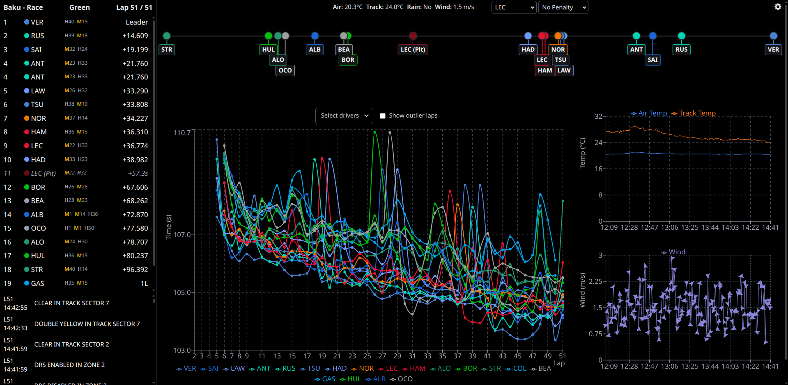

# Formula Strats

Formula Strats is a web application that analyzes and presents live Formula 1 data to provide strategic insights. The best companion for all armchair strategists.

## Key Features
- Pit simulation
    * Choose your driver (optionally add penalty to be served)
- Rankings
    * Includes gap to leader, lap info, track status
- Lap chart
- Weather data
- Line visualization of gap to leader
- Option to delay data (to sync with broadcast)
- Dark/light mode

## Under the hood

This section briefly describes the components of Formula Strats.

### Backend

The backend is composed of three main services orchestrated with Docker Compose:

- **`api`**: A FastAPI application that serves live data to the frontend via a Server-Sent Events (SSE) endpoint. It retrieves data from a Redis database using an asynchronous client.
- **`ingestor`**: Responsible for fetching live data from the Formula 1 WebSocket.
    - `live.py`: Connects to the WebSocket, processes the incoming data, publishes it to a Redis Pub/Sub channel, and stores it in the Redis database.
    - `runner.py`: Fetches the Formula 1 race schedule and triggers the `live.py` script.
- **`simulator`**: A simple FastAPI application that simulates the live Formula 1 WebSocket by reading data from a file. Useful for development and testing without a live race.

### Frontend

The frontend is an application built with React and TypeScript.

## Disclaimer
This project is unofficial and is not associated in any way with the Formula 1 companies. F1, FORMULA ONE, FORMULA 1, FIA FORMULA ONE WORLD CHAMPIONSHIP, GRAND PRIX and related marks are trade marks of Formula One Licensing B.V.
